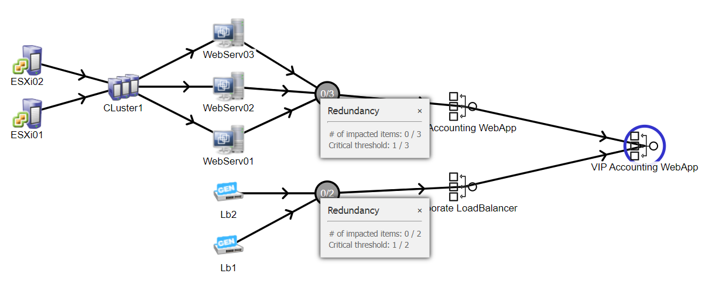
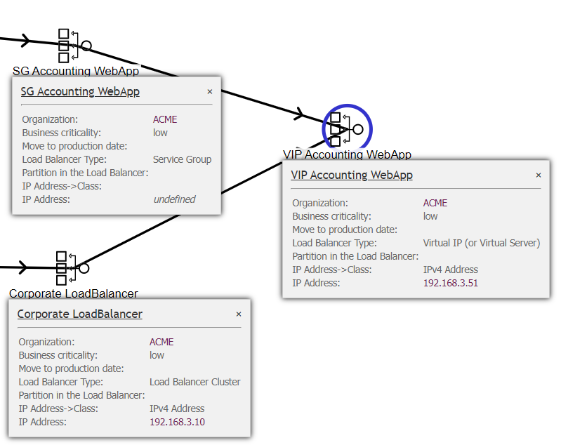
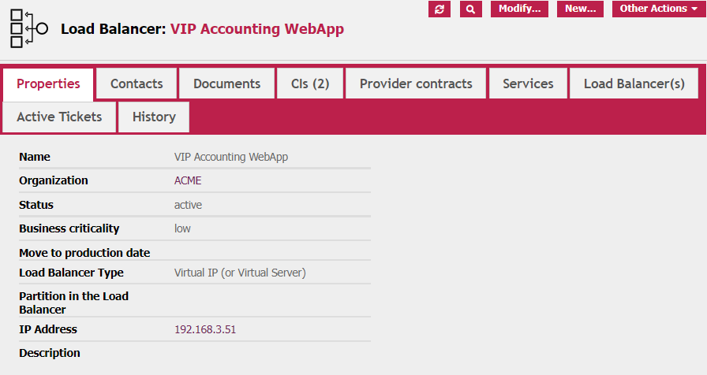
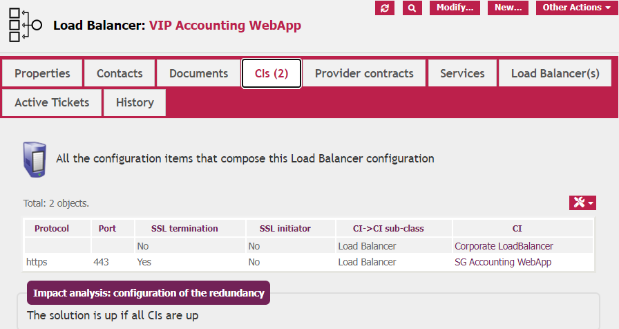
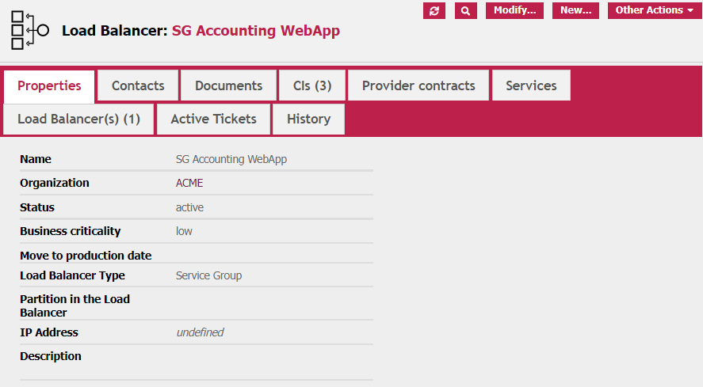
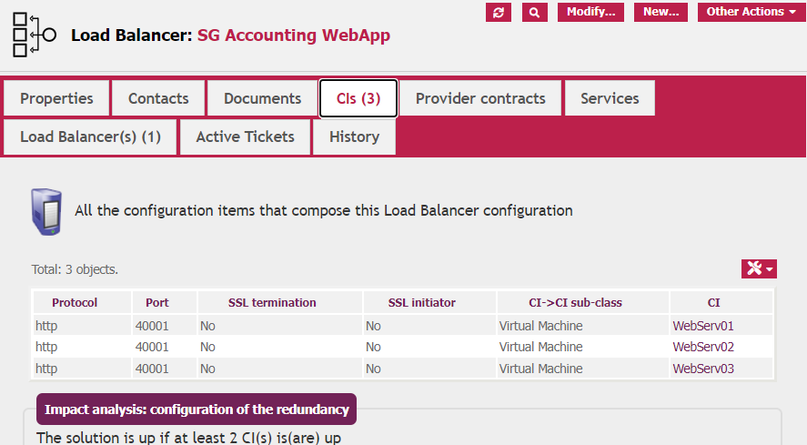
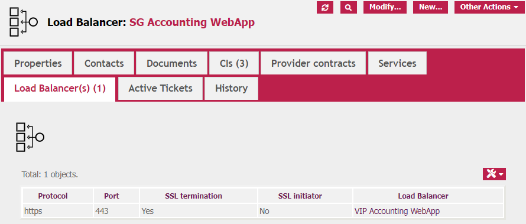
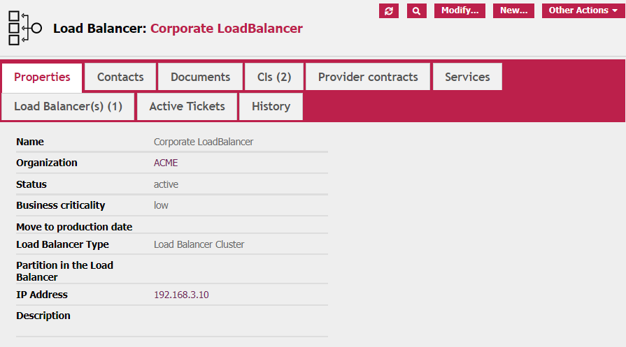
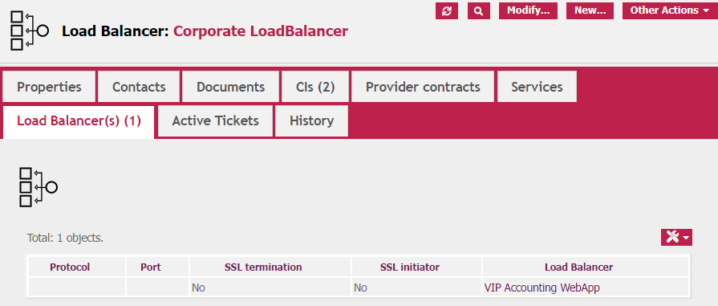
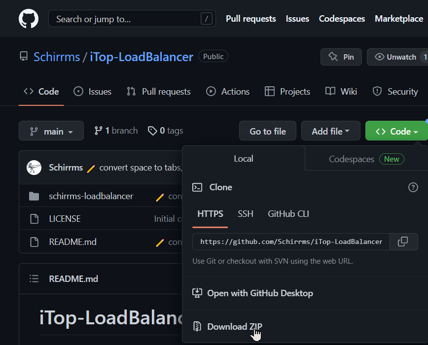

# iTop-LoadBalancer
Add 'Load Balancer' CI type to iTop

This Extension is highly inspired by the original 'ApplicationSolution' class. the idea is to have a versatile product, able to connect to virtually any Functional CI, as does the 'ApplicationSolution' class, but with some 'technical informations' available, mainly the IP address, not available in 'ApplicationSolution' and missing for our use.

## Further notes:

<ol>
	<li>As we use TeemIP, this extension has dependencies to 'TeemIP core'. It should not be a big work to remove this dependency, but I don't have time to test it!</li>
	<li>Our load balancers are A10 from A10network. So, while I wish to create an agnostic extension, it is possible that this extension will be 'tainted' with some A10 terminology.</li>
</ol>

# Table of Content

* [iTop-LoadBalancer](#iTop-LoadBalancer)
  * [Compatibility](#compatibility)
  * [State](#state)
* [Goal](#goal)
* [Usage](#usage)
  * [Load Balancer Operation](#very-crude-load-balancer-working-description)
	  * [Handling of SSL Connections](#specific-case-of-ssl-connections)
  * [Walking through an existing configuration](#walking-through-an-existing-configuration)
	  * [VIP configuration](#vip-configuration)
	  * [Service Group Configuration](#service-group-configuration)
	  * [Load Balancer Cluster Configuration](#load-balancer-cluster-configuration)		
* [Installation](#installation)
* [Thanks!](#thanks)

## Compatibility

This extension is compatible with iTop 2.7 and 3.x.

This extension relies on TeemIP, version >= 2.7

## State

Although young, I consider this Extension in 'Stable' state. I don't think that major braking changes are expected.

But I'm really interested knowing your opinion about this extension, and don't hesitate to put your comments on this forum.

[iTop - teemip Load Balancer Extension Available](https://sourceforge.net/p/itop/discussion/third-party-extensions/thread/a903301f68/)

# Goal

Load Balancer are part of our general configuration and need to be represented in our CMDB. iTop doesn't have a native way to represent Load Balancer, but, until now, we did use the 'ApplicationSolution' class to represent all our LoadBalancer configuration. The 'LoadBalancer' class is generic enough to represent any kind of dependencies between CIs.

Unfortunately, this has (at least) two drawbacks:
 
 * 'ApplicationSolution' have a very limited set of attributes, and miss at least IP address (which is not a natural part of an Application 😊) 
 * 'ApplicationSolution' are by design at a much higher level than LoadBalancer, so you will have technical stuff between functional process

So, I created this extension, to separate Load Balancer (Technical stuff) from ApplicationSolution, and to add some specific fields.

# Usage

Bear in mind that this extension was built from and for our usage, and we use A10 Load Balancers (from [A10Networks](https://www.a10networks.com/solutions/multi-cloud/load-balancing/)). As such, the vocabulary can be somewhat oriented, but it seems that most load balancer use more or less the same language.

## (Very crude) Load Balancer working description

An operational LoadBalancer configuration needs 3 kind of resources:

 * An active LoadBalancer (preferably a kind of Cluster LoadBalancer, to avoid a SPOF in your infrastructure)
 * On the load Balancer, a 'vip' configuration : this is mainly the virtual IP Address of the load balancing service, and also the port(s), protocols (mainly tcp or udp) if a layer 4 load balancer or the service(s) published (http/https, ftp ...).
 In the case of https, there is also the situation of the SSL termination. If the load Balancer 'terminates' the session, it is also the load Balancer who would take care of the SSL Certificate(s).
 * On the load balancer 'Service Group' configuration: this is configuration known to the load balancer, who will take care of the incoming flow. You can also see those service groups as destination for the flow.

 In short, a load balancer configuration needs:
  * A vip: this is the point of connection for the traffic
	* one or more service groups: those are the final destination of the traffic
	* And, obviously, an active Load Balancer: This is the global Software configuration of the resource.

### Specific case of SSL connections

In case of SSL Connection, different cases can be encountered:

 * Load Balancer to distribute the load and manage destination failures. In this case, the load balancer will be a 'Layer 4' Load Balancer, only redirecting the incoming IP flow to the different destinations, taking care of destination failure, but without any knowledge of the SSL contents.
 * SSL Offload: In this case, the SSL connection 'ends' on the load balancer, and the flow between the load balancer is in http (unencrypted). This is an easy way to centralizes SSL management, and this reduce a little bit the load of the endpoint. I don't want to start here a security discussion, but, obviously, as a part of the traffic is unencrypted, security measure should be on place to be sure that traffic interception is not possible on this part of the flow.
 * SSL to SSL connection: In this case, the Load Balancer 'terminates' with his own certificate the client flow, and then initiates (as an SSL client) a connection to the actual endpoint. Usage case: distributes traffic over many endpoints, but this is also a way to 'hide' an application using a private SSL certificate.
 * unencrypted to SSL: Well, this is technically possible: connection unencrypted to the load balancer, and SSL connection from the load balancer to the endpoint(s). But I don't see a usage case!

## Walking through an existing configuration

Suppose the following configuration: You have a pool of three Virtual Machines hosting an accounting web application. Those machines give the same service and are here to face the traffic peaks. The service is published unencrypted on tcp port 40001.

You plan to put a load balancer in front of those 3 VM. this load balancer will terminate the SSL connection on tcp port 443.

In iTop, the Dependencies are:

As you can see, I created 3 'Load Balancer' (roles) to represent this configuration:

 * The Virtual IP Type is the entry point of the configuration.
 * The Service Group Type is the configuration of the resources available to the load balancer
 * The Load Balancer Cluster type represents the complete Load Balancer structure. You don't need to represent this part unless you want to be able to track failures impacts.

In that meaning, the vip is only available if the service group(s) and the Load balancer cluster are available.

Let's dig in the view:

### VIP configuration

This is the view of the general tab of the VIP configuration:

And this is the view of the link to the underlying CIs (in this case two other Load Balancer Roles)

### Service Group Configuration

This is the view of the general tab of the Service Group configuration:

And this is the view of the link to the underlying CIs (in this case three Virtual Machines, but it can be any Functional CIs from the Database)

To be complete, I should also add a dependency to the Load Balancer cluster, as the Service Group cannot work without. But this complexifies the display and as, in case of a malfunctioning cluster, the VIP would be red, the expected result is OK without this link.

We can also see what upstream Load Balancers configurations are using these Service Group:

### Load Balancer Cluster Configuration

This is the view of the general tab of the Load Balancer Cluster configuration:

And this is the view of the link to the underlying CIs (in this case two Generic Comm Device -another of my extensions-, but it can be any Functional CIs from the Database)

We can also see what upstream Load Balancers configurations are using this Cluster:

# Installation

As for all my extensions, just download go to [Github.com](https://github.com/Schirrms/iTop-LoadBalancer), Select CODE --> Download Zip:

Open the Zip file, and, in the ***-main folder, copy the 'schirrms-...' directory in your extensions directory, then rerun the iTop setup as usual.

# Thanks

I really want to thank:

* The whole Combodo team who brings to us such a remarkable (and nearly unbreakable!) tool
* Christophe ([Xtophe38](https://github.com/xtophe38)) proud father of the TeemIP extensions
* All the people on the iTop forum, including but not only Guillaume Lajarige/ Molkobain, Pierre Goiffon, Jeffrey, Vincent Dumas...
* ... You! You who read that far!